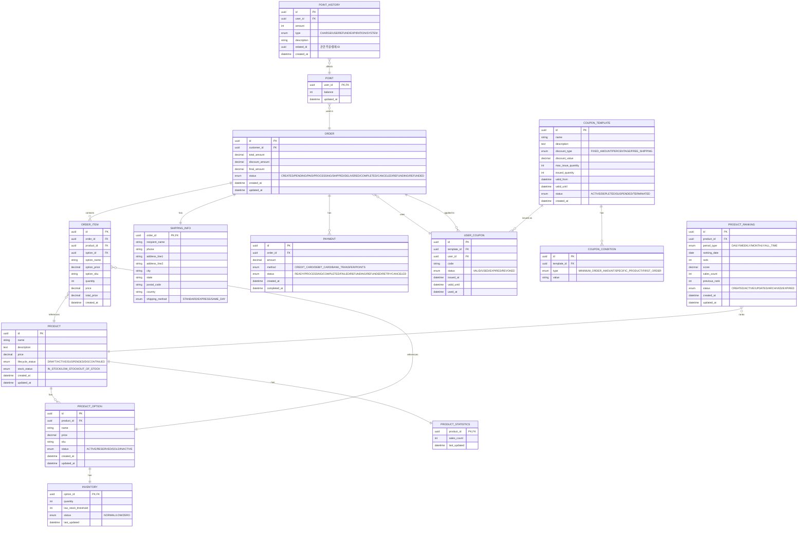

```mermaid
erDiagram
%% 상품 도메인
    PRODUCT {
        uuid id PK
        string name
        text description
        decimal price
        enum lifecycle_status "DRAFT/ACTIVE/SUSPENDED/DISCONTINUED"
        enum stock_status "IN_STOCK/LOW_STOCK/OUT_OF_STOCK"
        datetime created_at
        datetime updated_at
    }

    PRODUCT_OPTION {
        uuid id PK
        uuid product_id FK
        string name
        decimal price
        string sku
        enum status "ACTIVE/RESERVED/SOLD/INACTIVE"
        datetime created_at
        datetime updated_at
    }

    INVENTORY {
        uuid option_id PK, FK
        int quantity
        int low_stock_threshold
        enum status "NORMAL/LOW/ZERO"
        datetime last_updated
    }

    PRODUCT_STATISTICS {
        uuid product_id PK, FK
        int sales_count
        datetime last_updated
    }

%% 주문결제 도메인
    ORDER {
        uuid id PK
        uuid customer_id FK
        decimal total_amount
        decimal discount_amount
        decimal final_amount
        enum status "CREATED/PENDING/PAID/PROCESSING/SHIPPED/DELIVERED/COMPLETED/CANCELED/REFUNDING/REFUNDED"
        datetime created_at
        datetime updated_at
    }

    ORDER_ITEM {
        uuid id PK
        uuid order_id FK
        uuid product_id FK
        uuid option_id FK
        string option_name
        decimal option_price
        string option_sku
        int quantity
        decimal price
        decimal total_price
        datetime created_at
    }

    SHIPPING_INFO {
        uuid order_id PK, FK
        string recipient_name
        string phone
        string address_line1
        string address_line2
        string city
        string state
        string postal_code
        string country
        enum shipping_method "STANDARD/EXPRESS/SAME_DAY"
    }

    PAYMENT {
        uuid id PK
        uuid order_id FK
        decimal amount
        enum method "CREDIT_CARD/DEBIT_CARD/BANK_TRANSFER/POINTS"
        enum status "READY/PROCESSING/COMPLETED/FAILED/REFUNDING/REFUNDED/RETRY/CANCELED"
        datetime created_at
        datetime completed_at
    }

%% 쿠폰 도메인
    COUPON_TEMPLATE {
        uuid id PK
        string name
        text description
        enum discount_type "FIXED_AMOUNT/PERCENTAGE/FREE_SHIPPING"
        decimal discount_value
        int max_issue_quantity
        int issued_quantity
        datetime valid_from
        datetime valid_until
        enum status "ACTIVE/DEPLETED/SUSPENDED/TERMINATED"
        datetime created_at
    }

    USER_COUPON {
        uuid id PK
        uuid template_id FK
        uuid user_id FK
        string code
        enum status "VALID/USED/EXPIRED/REVOKED"
        datetime issued_at
        datetime valid_until
        datetime used_at
    }

    COUPON_CONDITION {
        uuid id PK
        uuid template_id FK
        enum type "MINIMUM_ORDER_AMOUNT/SPECIFIC_PRODUCT/FIRST_ORDER"
        string value
    }

%% 포인트 도메인
    POINT {
        uuid user_id PK, FK
        int balance
        datetime updated_at
    }

    POINT_HISTORY {
        uuid id PK
        uuid user_id FK
        int amount
        enum type "CHARGE/USE/REFUND/EXPIRATION/SYSTEM"
        string description
        uuid related_id "관련 주문/결제 ID"
        datetime created_at
    }

%% 상품랭킹 도메인
    PRODUCT_RANKING {
        uuid id PK
        uuid product_id FK
        enum period_type "DAILY/WEEKLY/MONTHLY/ALL_TIME"
        date ranking_date
        int rank
        decimal score
        int sales_count
        int previous_rank
        enum status "CREATED/ACTIVE/UPDATED/ARCHIVED/EXPIRED"
        datetime created_at
        datetime updated_at
    }

%% 관계 정의
    PRODUCT ||--o{ PRODUCT_OPTION: "has"
    PRODUCT ||--|| PRODUCT_STATISTICS: "has"
    PRODUCT_OPTION ||--|| INVENTORY: "has"
    ORDER ||--o{ ORDER_ITEM: "contains"
    ORDER ||--|| SHIPPING_INFO: "has"
    ORDER ||--o{ PAYMENT: "has"
    ORDER }o--|| USER_COUPON: "uses"
    ORDER_ITEM }o--|| PRODUCT: "references"
    ORDER_ITEM }o--|| PRODUCT_OPTION: "references"
    COUPON_TEMPLATE ||--o{ USER_COUPON: "issued as"
    COUPON_TEMPLATE ||--o{ COUPON_CONDITION: "has"
    USER_COUPON }o--|| ORDER: "applied to"
    POINT_HISTORY }o--|| POINT: "affects"
    POINT }o--|| ORDER: "used in"
    PRODUCT_RANKING }o--|| PRODUCT: "ranks"

```
