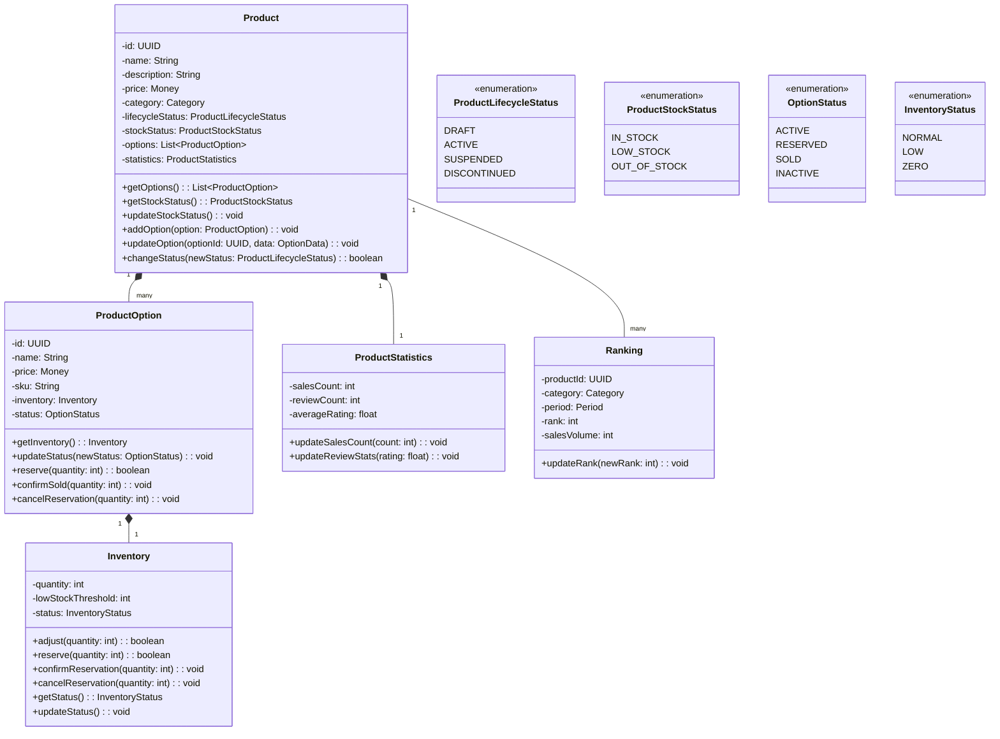
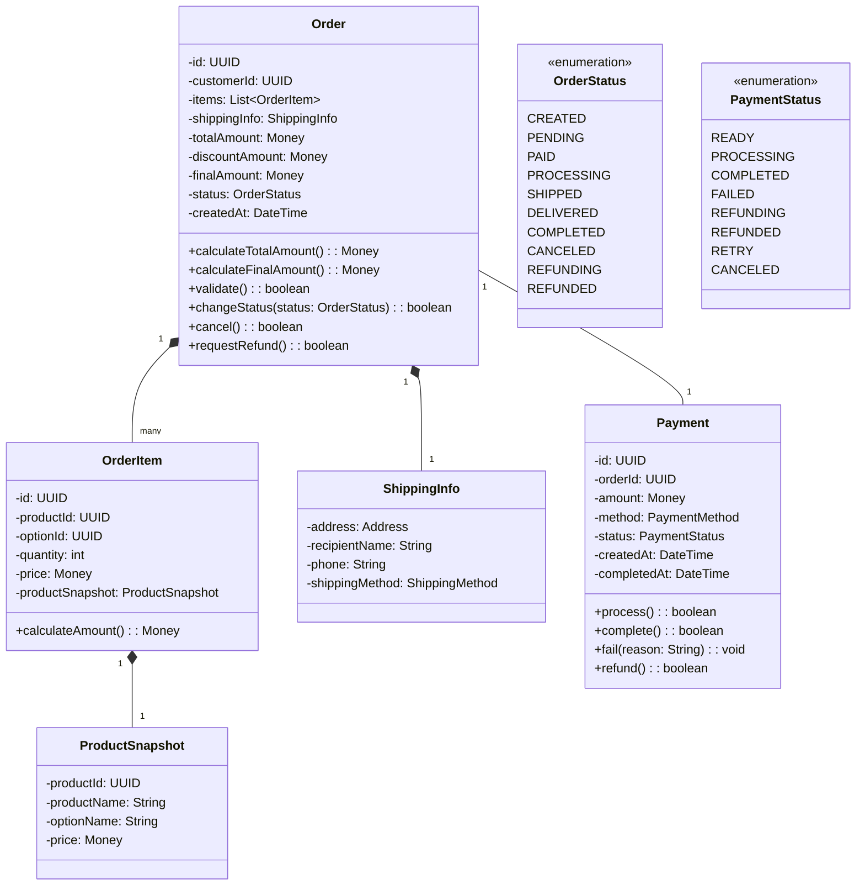
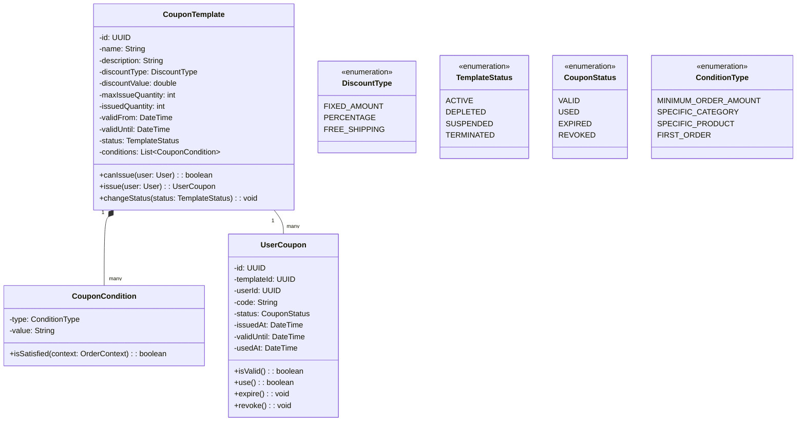
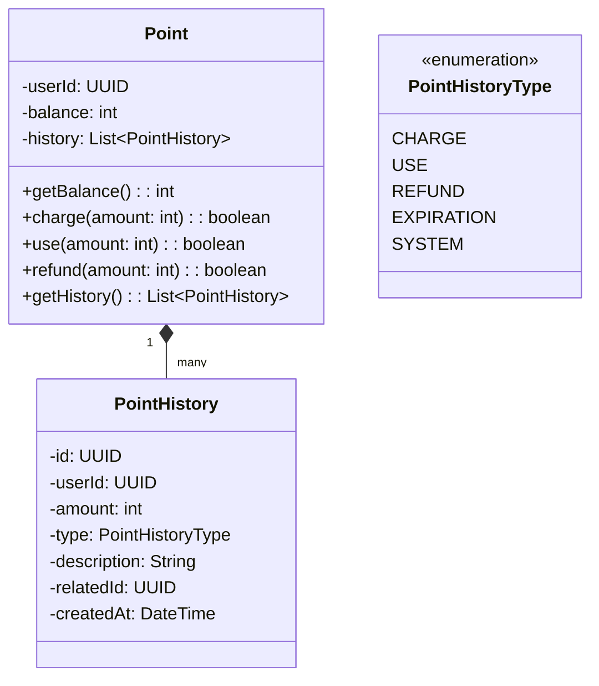
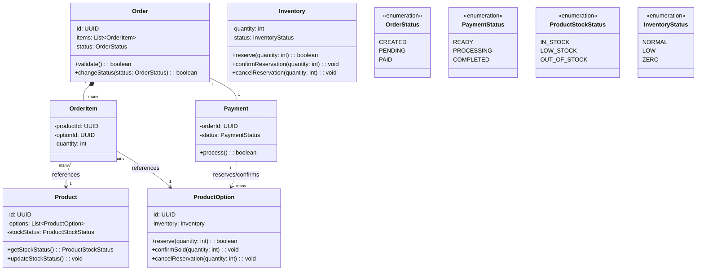
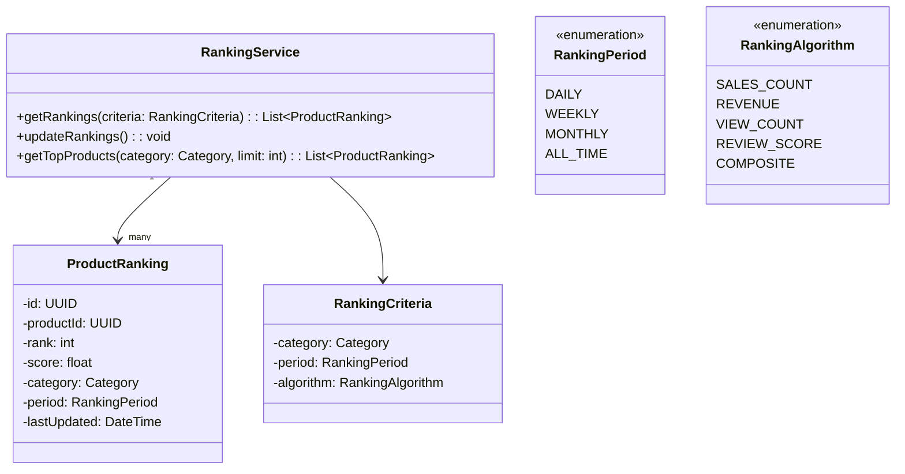
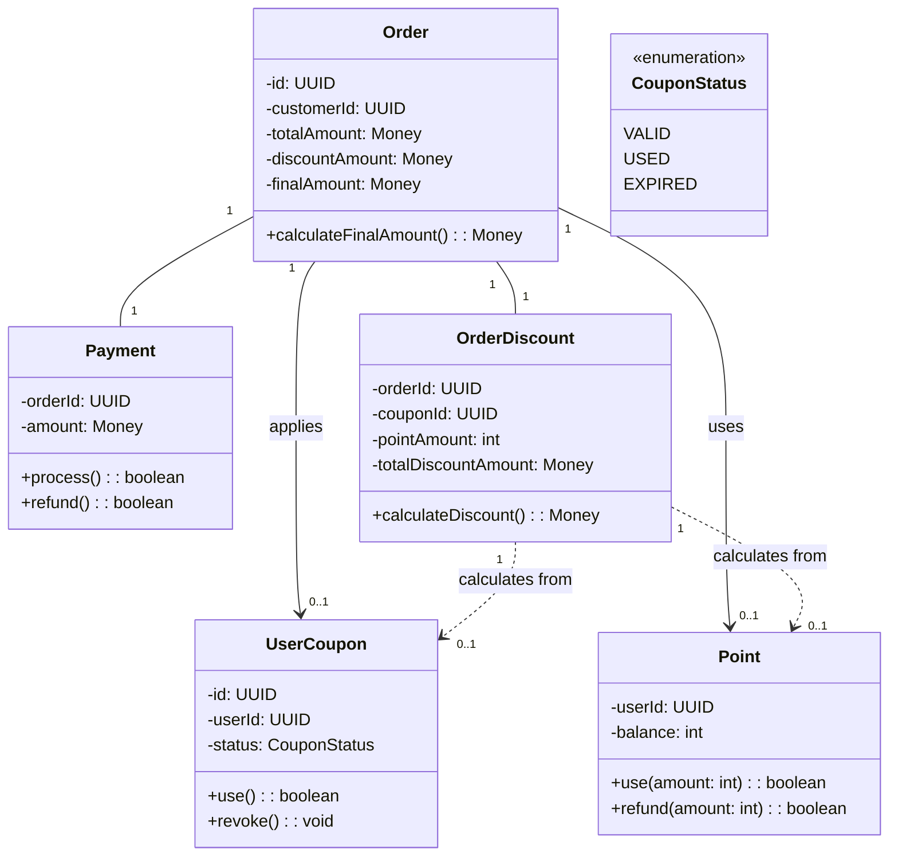
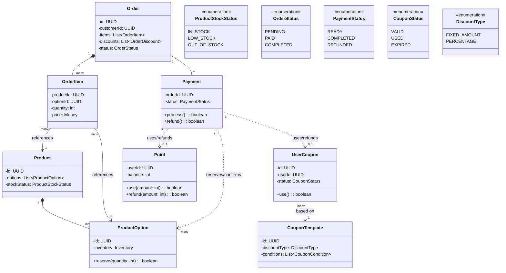

# 이커머스 시스템 클래스 다이어그램

## 목차

- [이커머스 시스템 클래스 다이어그램](#이커머스-시스템-클래스-다이어그램)
    - [목차](#목차)
    - [개별 도메인 클래스 다이어그램](#개별-도메인-클래스-다이어그램)
        - [상품 도메인](#상품-도메인)
        - [주문결제 도메인](#주문결제-도메인)
        - [쿠폰 도메인](#쿠폰-도메인)
        - [포인트 도메인](#포인트-도메인)
    - [도메인 간 연결 다이어그램](#도메인-간-연결-다이어그램)
        - [주문결제-상품 연결](#주문결제-상품-연결)
        - [주문결제-쿠폰-포인트 연결](#주문결제-쿠폰-포인트-연결)
        - [전체 도메인 통합 다이어그램](#전체-도메인-통합-다이어그램)

## 개별 도메인 클래스 다이어그램

### 상품 도메인

### 주문결제 도메인

### 쿠폰 도메인

### 포인트 도메인

## 도메인 간 연결 다이어그램

### 주문결제-상품 연결

다음 다이어그램은 주문 생성 및 결제 처리 시 상품 도메인과의 상호작용을 보여줍니다.

### 랭킹 도메인

### 주문결제-쿠폰-포인트 연결

다음 다이어그램은 주문 및 결제 시 쿠폰과 포인트의 사용을 보여줍니다.

### 전체 도메인 통합 다이어그램

다음은 모든 주요 도메인 간의 관계를 보여주는 통합 다이어그램입니다. 복잡성을 줄이기 위해 핵심 클래스와 관계만 표시했습니다.

