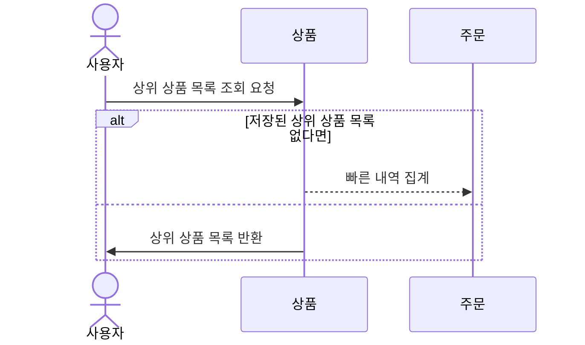
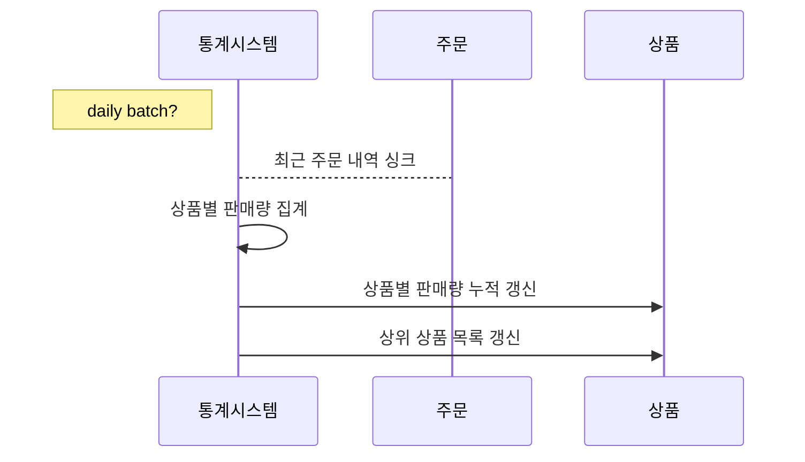

# 상위 상품 목록 조회

```mermaid
sequenceDiagram
    actor 사용자
    participant 상품
    사용자 ->> 상품: 상위 상품 목록 조회 요청
    alt 저장된 상위 상품 목록 없다면
        상품 -->> 주문: 빠른 내역 집계
    else
        상품 ->> 사용자: 상위 상품 목록 반환
    end
```

# [배치작업] 상품 통계 캐시 갱신

```mermaid
sequenceDiagram
    participant 통계시스템
    note left of 통계시스템: daily batch?
    participant 주문
    participant 상품
    통계시스템 --> 주문: 최근 주문 내역 싱크
    통계시스템 ->> 통계시스템: 상품별 판매량 집계
    통계시스템 ->> 상품: 상품별 판매량 누적 갱신
    통계시스템 ->> 상품: 상위 상품 목록 갱신
```