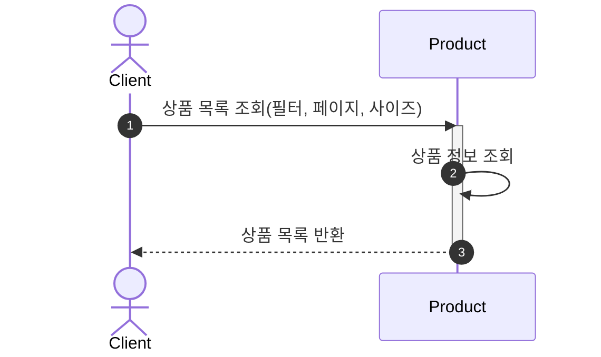
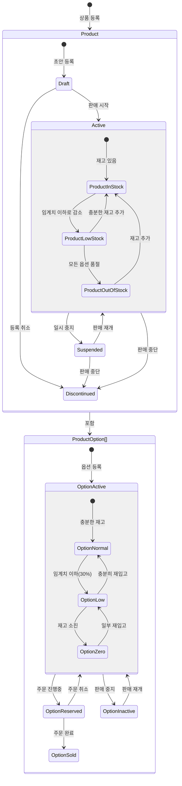
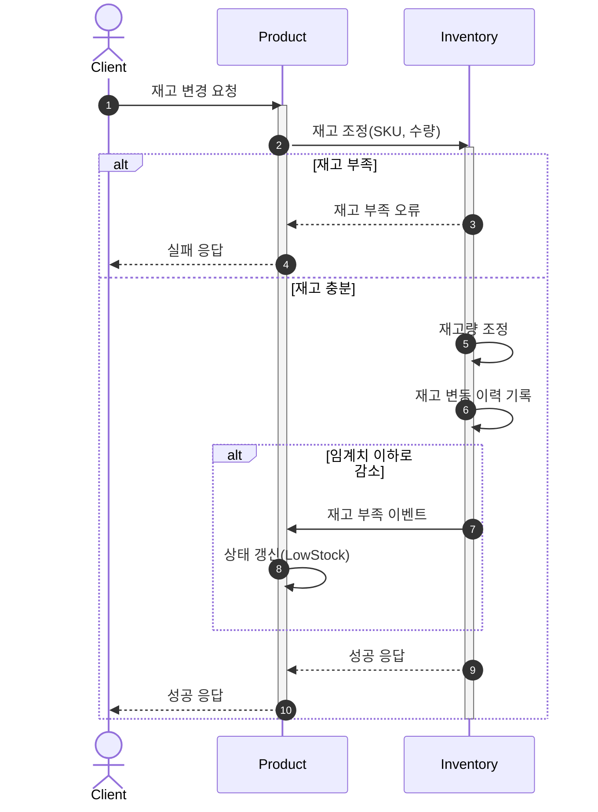
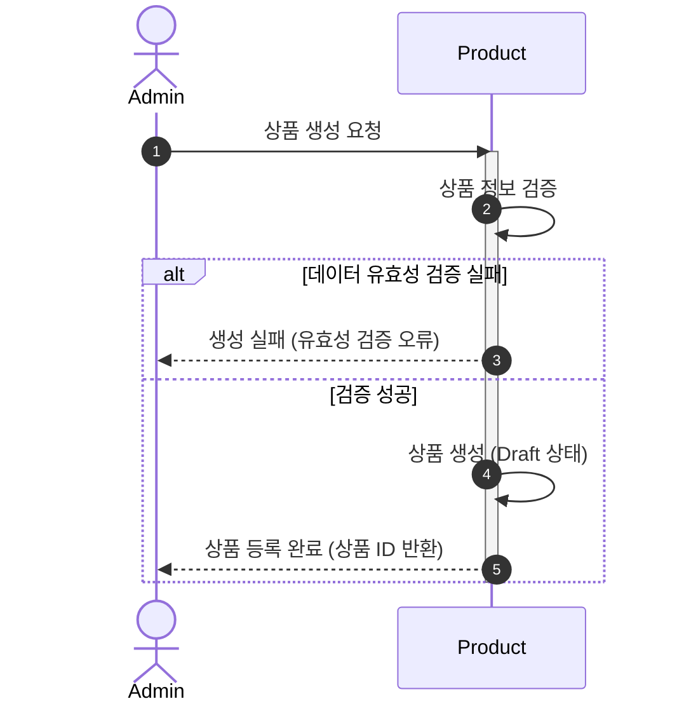
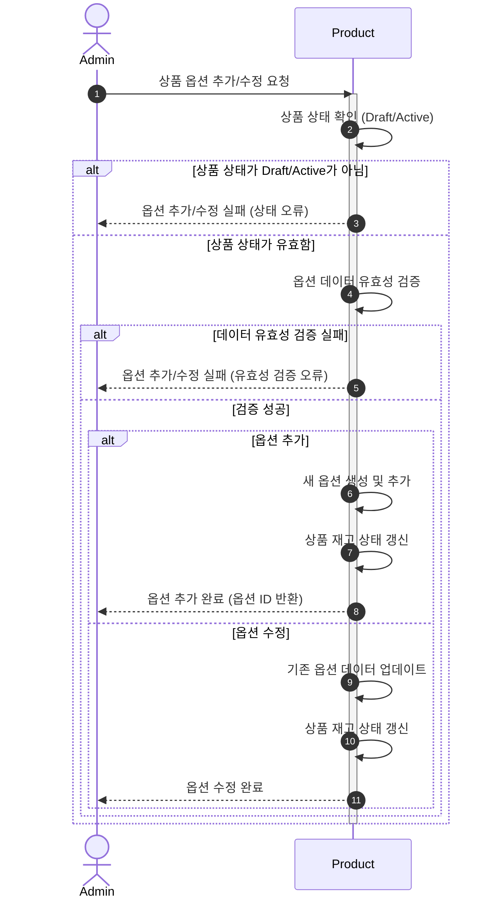
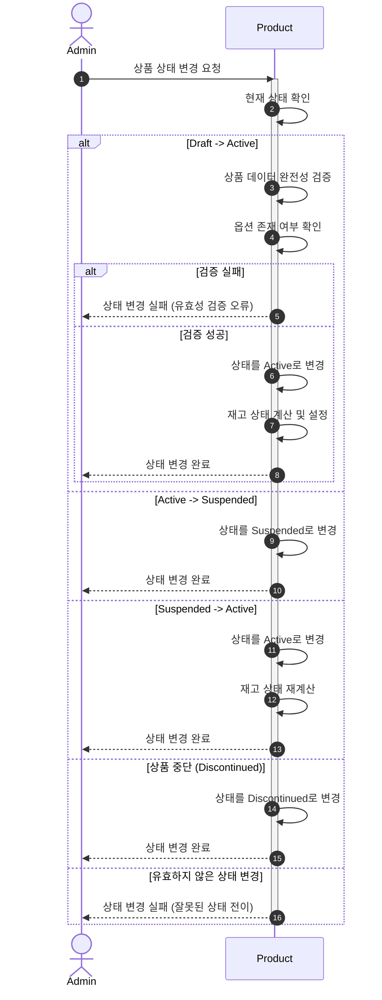

### 목차

- [상품 도메인](#상품-도메인)
- [상품 조회](#상품-조회)
- [상위 상품 목록 조회](#상위-상품-목록-조회)
- [상품 라이프사이클](#상품-라이프사이클)
- [재고 변경 요청](#재고-변경-요청)
- [(Optional) 상품 생성/등록 프로세스](#optional-상품-생성등록-프로세스)
- [(Optional) 상품 옵션 추가/수정 프로세스](#optional-상품-옵션-추가수정-프로세스)
- [(Optional) 상품 상태 변경 프로세스](#optional-상품-상태-변경-프로세스)

# 상품 도메인

상품(Product)은 판매를 위한 물품을 표현하는 [애그리게이트](https://en.wikipedia.org/wiki/Domain-driven_design#Aggregates) 루트입니다. 여러 개의 상품 옵션(
ProductOption)을 포함합니다

- 상품은 Draft, Active, Suspended, Discontinued 등의 라이프사이클 상태를 가집니다.
- 각 상품 옵션은 자체적인 재고 수량과 상태(Normal, Low, Zero 등)를 가집니다.
- 상품의 전체 재고 상태(InStock, LowStock, OutOfStock)는 포함된 옵션들의 재고 상태에 따라 결정됩니다.
- 상품은 판매량, 리뷰 수, 평점 등의 통계 정보를 가질 수 있습니다.
- 상품 조회, 등록, 수정, 삭제 등의 기본 CRUD 작업을 지원합니다.
- 상품 옵션의 추가, 수정, 삭제 및 재고 관리 기능을 제공합니다.
- 상품의 판매 순위를 기반으로 상위 상품 목록을 조회할 수 있습니다.

# 상품 조회

# 상품 라이프사이클

# 재고 변경 요청

이 접근법에서는 재고(Inventory)가 Product 애그리게이트의 내부 컴포넌트입니다.
재고 상태와 수량은 ProductOption 엔티티에 직접 포함되며, 모든 재고 변경은
Product 애그리게이트 루트를 통해 이루어집니다.

장점: 트랜잭션 일관성 보장, 간단한 구현
단점: 대량의 재고 변경 작업 시 성능 이슈 가능성

# (Optional) 상품 생성/등록 프로세스

# (Optional) 상품 옵션 추가/수정 프로세스

# (Optional) 상품 상태 변경 프로세스

