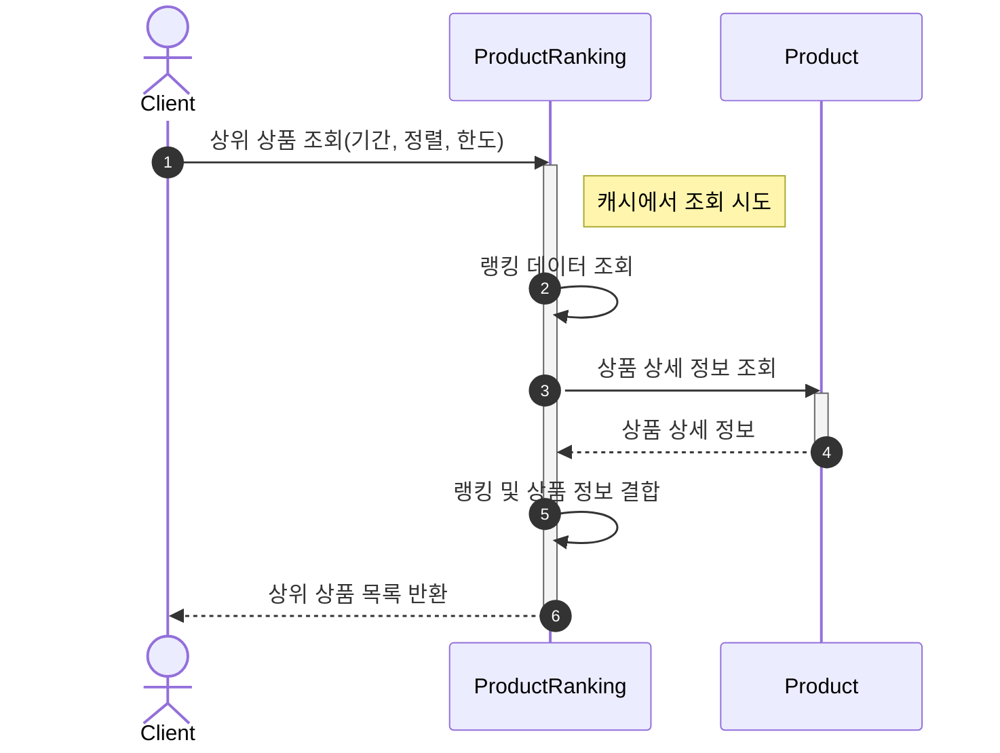
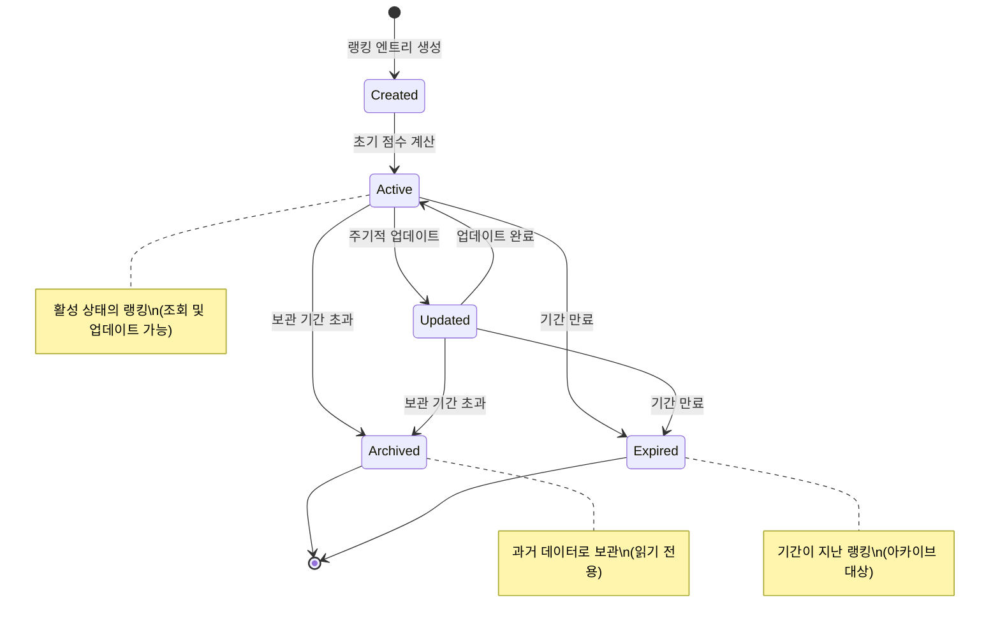
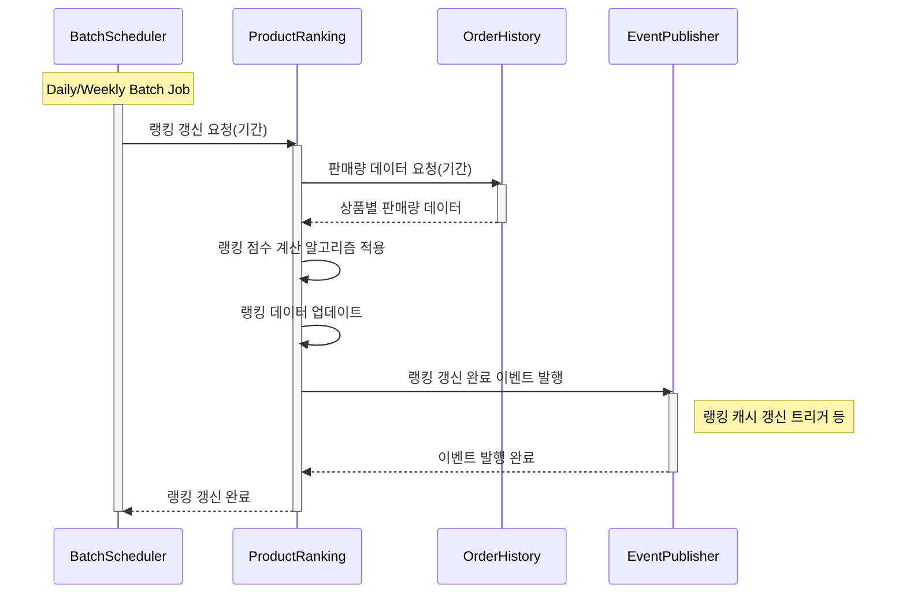
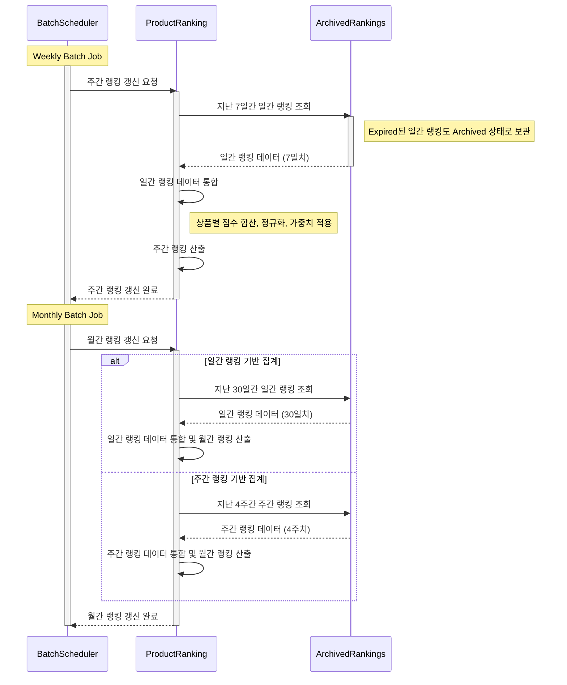
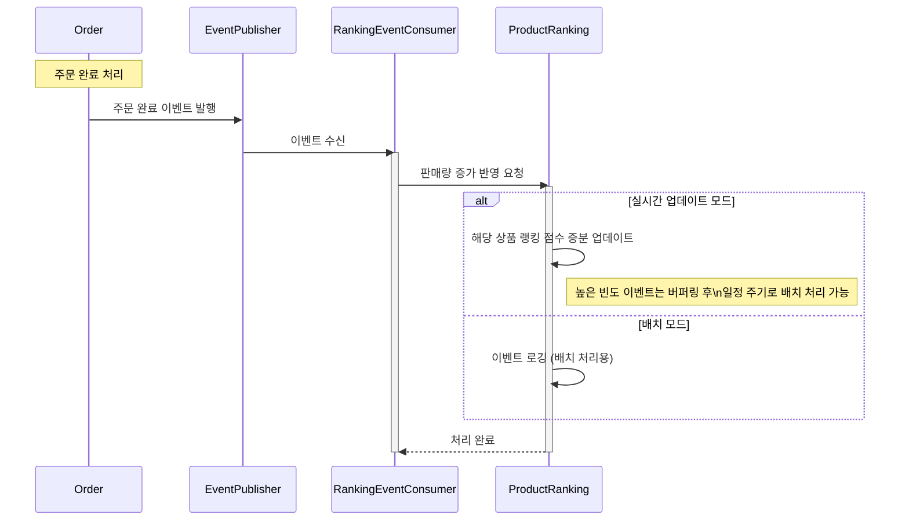

### 목차

- [상품랭킹 도메인](#상품랭킹-도메인)
- [상위 상품 목록 조회](#상위-상품-목록-조회)
- [랭킹 데이터 캐싱](#랭킹-데이터-캐싱)
- [상품랭킹 라이프사이클](#상품랭킹-라이프사이클)
- [랭킹 갱신 프로세스](#랭킹-갱신-프로세스)
- [계층적 시간 집계](#계층적-시간-집계)
- [(Optional) 이벤트 기반 실시간 랭킹 업데이트](#optional-이벤트-기반-실시간-랭킹-업데이트)

# 상품랭킹 도메인

상품랭킹(Product Ranking)은 상품의 인기도나 성과를 측정하여 순위를 매기는 도메인입니다. 랭킹은 주로 판매량, 조회수, 리뷰 점수 등의 지표를 기반으로 계산됩니다.

- 상품랭킹은 독립적인 애그리게이트로 관리됩니다.

  - 각 랭킹 엔트리는 상품 ID, 순위, 점수, 기간 등의 정보를 포함합니다.
  - 랭킹은 다양한 기간(일간, 주간, 월간, 전체)별로 관리됩니다.

- 랭킹 시스템은 다음 기능을 제공합니다:

  - 상위 상품 목록 조회: 특정 기간에 대한 상위 상품 목록을 반환
  - 랭킹 갱신: 주기적인 배치 작업을 통해 최신 데이터 기반으로 랭킹 갱신
  - 랭킹 점수 계산: 판매량 등 다양한 지표를 기반으로 랭킹 점수 계산

- 확장성 고려사항:
  - 판매량 외에도 다양한 랭킹 알고리즘 적용 가능
  - 새로운 랭킹 기준 추가 용이
  - 이벤트 기반 실시간 업데이트 지원 가능

# 상위 상품 목록 조회

# 랭킹 데이터 캐싱

> 💡 **구현 참고 사항**: 랭킹 데이터는 읽기가 매우 빈번하고 쓰기는 주로 배치 작업으로 이루어지는 특성이 있습니다. 따라서 캐싱 전략이 중요합니다:
>
> - 기간별 상위 N개 상품 목록을 캐시에 저장
> - 캐시 만료 시간은 랭킹 갱신 주기보다 약간 길게 설정
> - 랭킹 갱신 완료 후 캐시 강제 갱신
> - Redis 등의 인메모리 데이터베이스 활용 고려

# 상품랭킹 라이프사이클

# 랭킹 갱신 프로세스

# 계층적 시간 집계

> 💡 **구현 참고 사항**: 계층적 시간 집계(Temporal Hierarchical Aggregation)는 다음과 같은 장점이 있습니다:
>
> - 계산 효율성: 모든 원시 데이터(주문 이력)를 재처리하지 않고 이미 계산된 하위 기간 랭킹을 활용
> - 저장 공간 최적화: 모든 시간대의 원시 데이터를 보관할 필요 없이 집계된 결과만 보관 가능
> - 일관성: 일간 → 주간 → 월간으로 이어지는 집계 흐름에서 일관된 계산 로직 적용
> - 장애 복구: 특정 기간의 집계에 문제가 발생해도 아카이브된 하위 집계 데이터로 재계산 가능

# (Optional) 이벤트 기반 실시간 랭킹 업데이트

> 💡 **구현 참고 사항**: 실시간 랭킹 업데이트는 성능 영향을 고려해야 합니다:
>
> - 주문량이 많은 경우 모든 이벤트를 실시간으로 반영하면 성능 저하 가능
> - 카운터 증분 방식 또는, 일정 기간 이벤트 버퍼링 후 배치 처리 검토
> - 인기 상품에 대한 실시간성과 시스템 부하 간의 균형 필요
