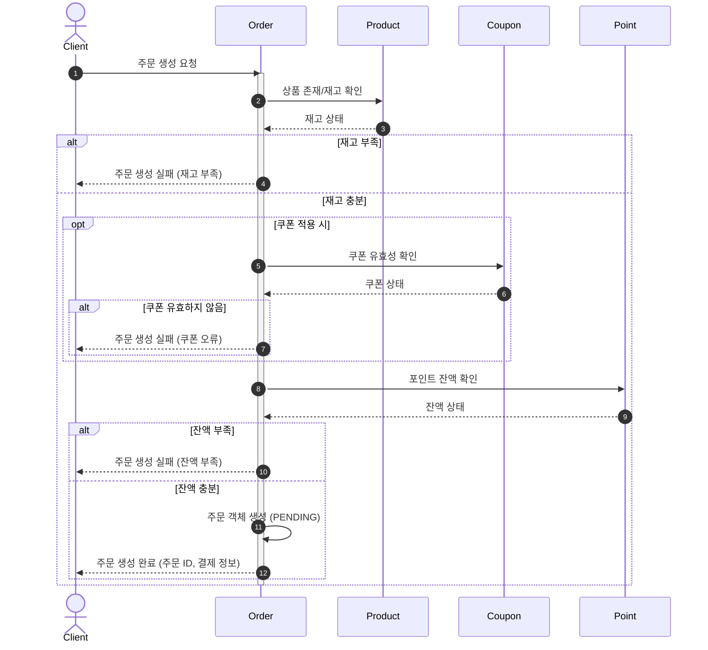
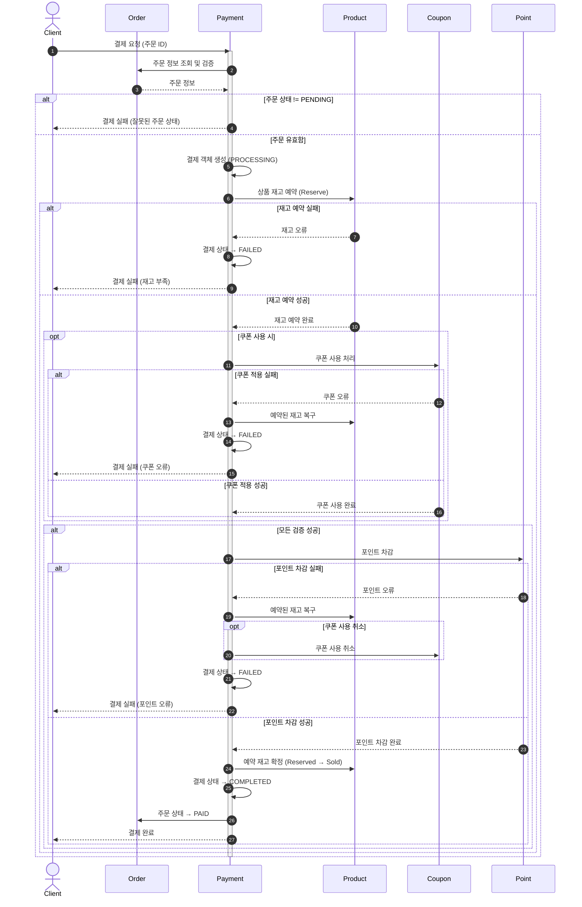
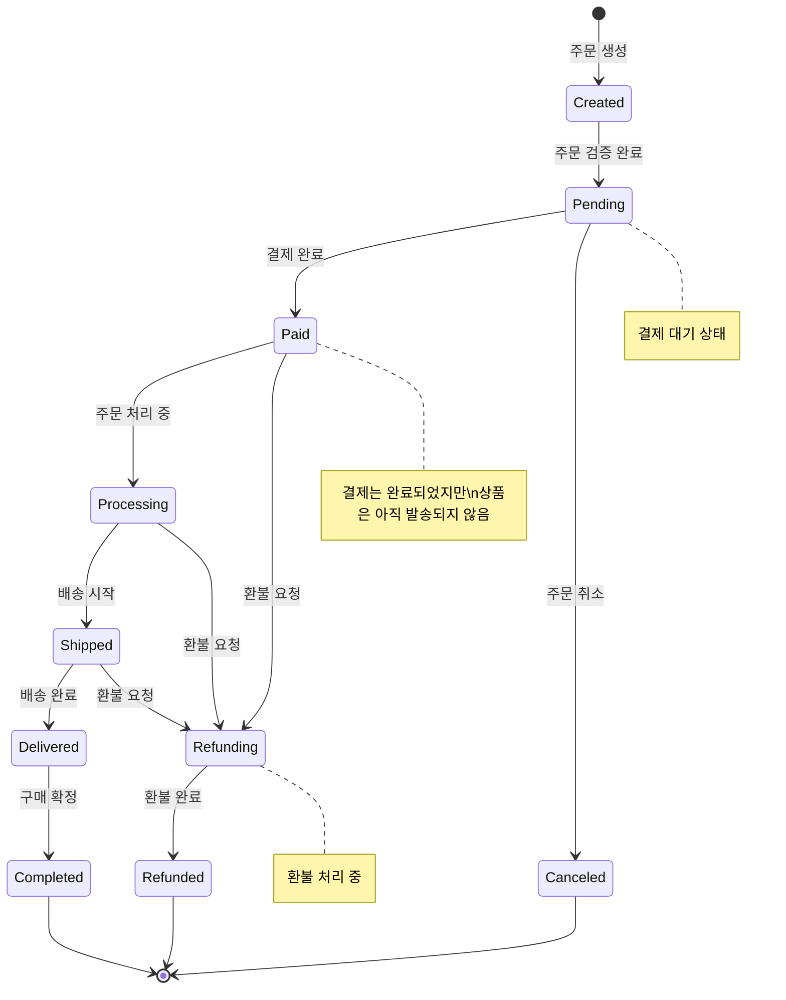
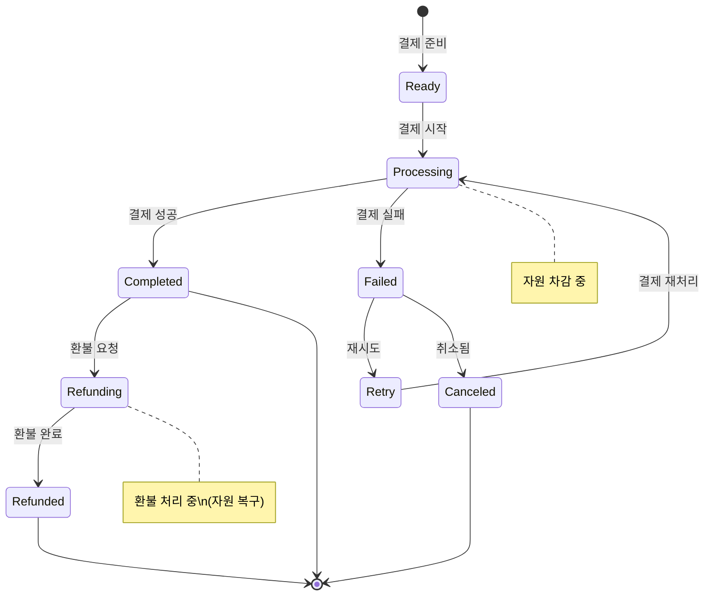
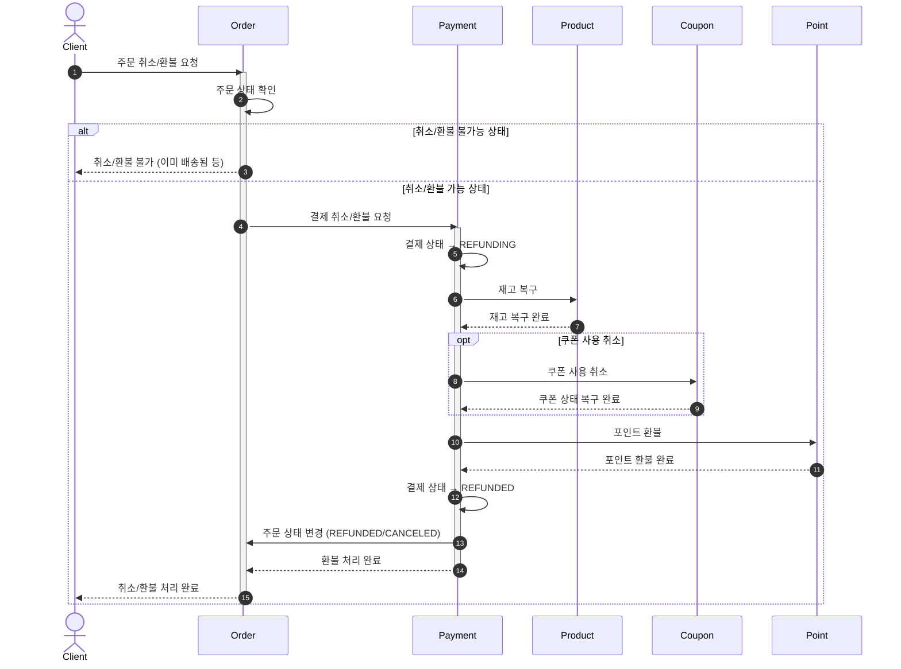
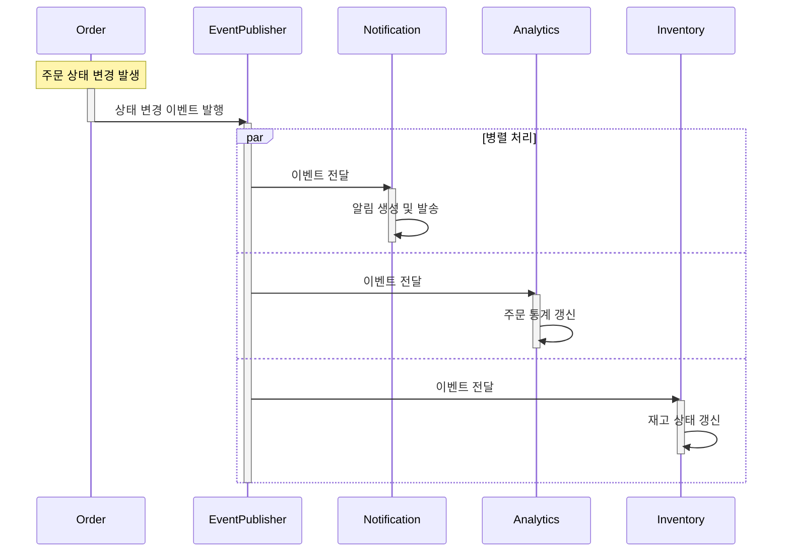

# 주문결제 도메인 문서

### 목차

- [주문결제 도메인 문서](#주문결제-도메인-문서)
  - [목차](#목차)
- [주문결제 도메인](#주문결제-도메인)
- [주문 생성](#주문-생성)
- [결제 처리](#결제-처리)
- [주문 라이프사이클](#주문-라이프사이클)
- [결제 라이프사이클](#결제-라이프사이클)
- [주문 취소/환불](#주문-취소환불)
- [(Optional) 주문 상태 변경 이벤트 처리](#optional-주문-상태-변경-이벤트-처리)

# 주문결제 도메인

주문(Order)은 고객의 구매 의사를 표현하는 애그리게이트 루트이며, 결제(Payment)는 주문에 대한 금전적 처리를 표현하는 별도의 애그리게이트입니다.

- 주문은 여러 주문 항목(OrderItem)을 포함하는 애그리게이트입니다.
  - 주문은 Pending, Paid, Completed, Canceled 등의 라이프사이클 상태를 가집니다.
  - 주문은 상품, 수량, 가격 정보를 포함합니다.
  - 주문은 배송 정보, 할인 정보, 최종 결제 금액 등의 정보를 포함합니다.
- 결제는 주문에 대한 자금 이체를 처리하는 애그리게이트입니다.

  - 결제는 Ready, Processing, Completed, Failed, Refunded 등의 라이프사이클 상태를 가집니다.
  - 결제는 여러 자원(포인트, 쿠폰, 상품 재고)의 차감을 포함합니다.
  - 결제는 성공/실패에 따라 주문 상태를 변경합니다.

- 주문과 결제의 분리 원칙:
  - 주문은 고객의 "의도"를 표현하며, 결제는 그 의도를 "실행"하는 개념입니다.
  - 주문 생성 시점에는 자원 유효성을 확인하고, 결제 시점에 최종 검증과 차감을 수행합니다.
  - 이 분리는 주문-결제 간 시간차를 허용하고 복잡한 결제 실패 처리를 단순화합니다.

# 주문 생성

# 결제 처리

# 주문 라이프사이클

# 결제 라이프사이클

# 주문 취소/환불

# (Optional) 주문 상태 변경 이벤트 처리

