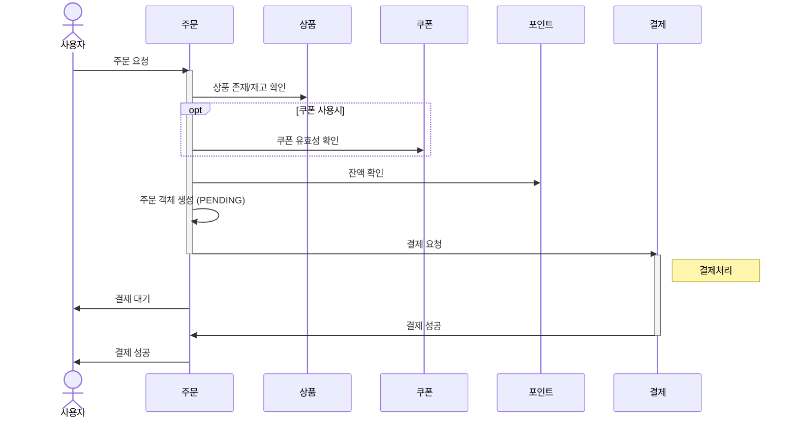
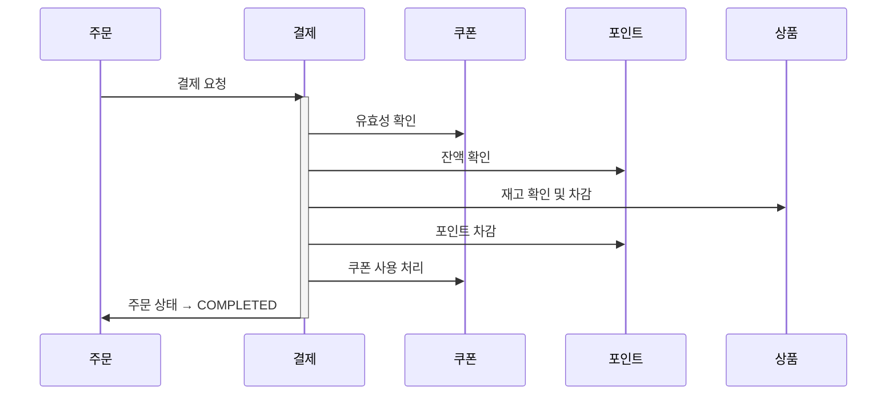
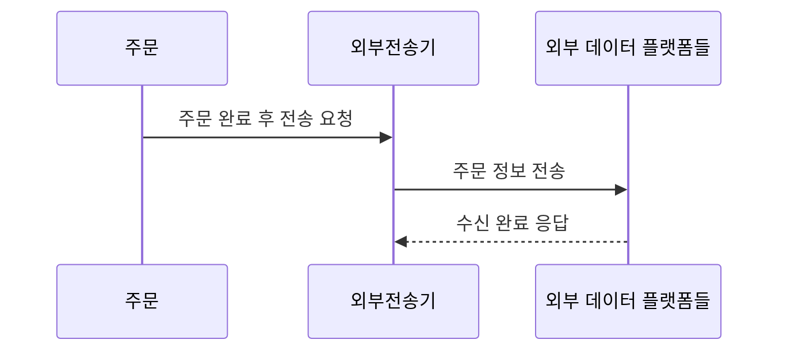

# 주문과 결제를 구분합니다

> 주문과 결제를 분리하면, 주문은 성공해도 결제(포인트/쿠폰/재고 자원 차감)에서 재검증이 필요하고
> 실패할 수 있는데요?

해결 방법은 결국 락(Lock) 범위와 위치 조정인데, 이건 트레이드오프입니다.

1. “주문 생성” 시점에 락을 걸고 자원 예약
    - 주문을 받을 때 미리 자원을 임시 차감하거나 예약 처리
    - ✅ 실패율 ↓
    - ❌ 락 유지 시간 ↑, 롤백 필요, 주문 취소 재처리 복잡

2. 방법 2: “결제 시점”에 자원 확인 및 차감
    - 현실적이고, 시스템 부하 덜함
    - ✅ 단순한 구현
    - ❌ 사용자는 주문했지만 결제 실패 가능성 존재

# 주문 생성

사용자 요청에 따라 "주문 객체 생성"

# 결제 처리

- 주문 도메인의 호출에 따라 "리소스 차감".
- 차감가능성 검증을 선행해서 락 지속시간을 줄이고 롤백가능성 줄임(?)
  (롤백 예방보다 롤백이 쉬운 구조가 더 중요하지않나..)
- 가장 취약한(공유되는) 상품재고에 대한 조회-차감이 붙어야 할듯

# 주문 성공 transition effect

