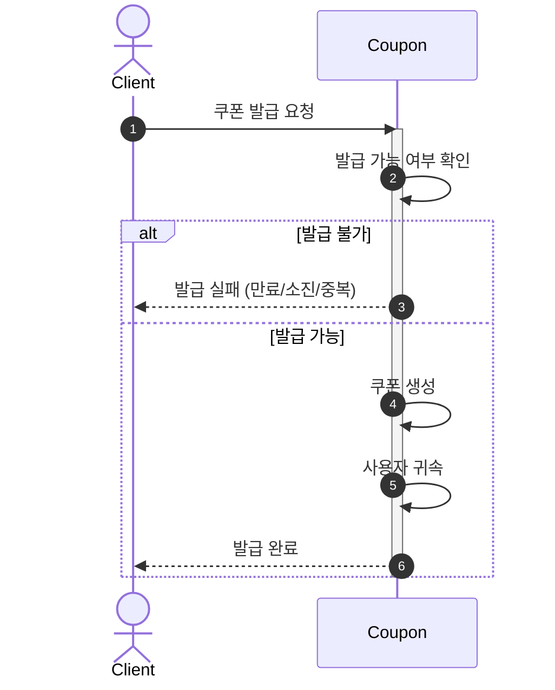
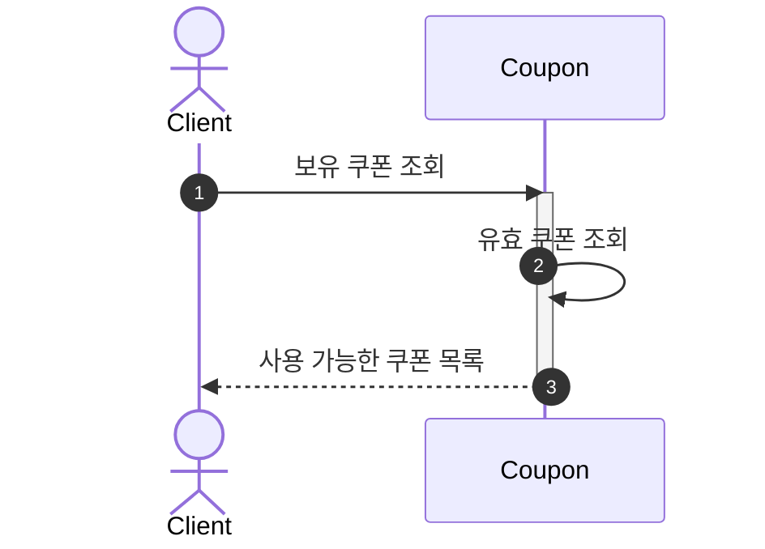
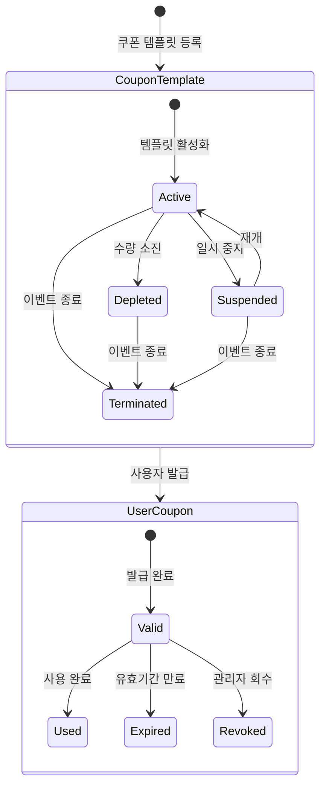
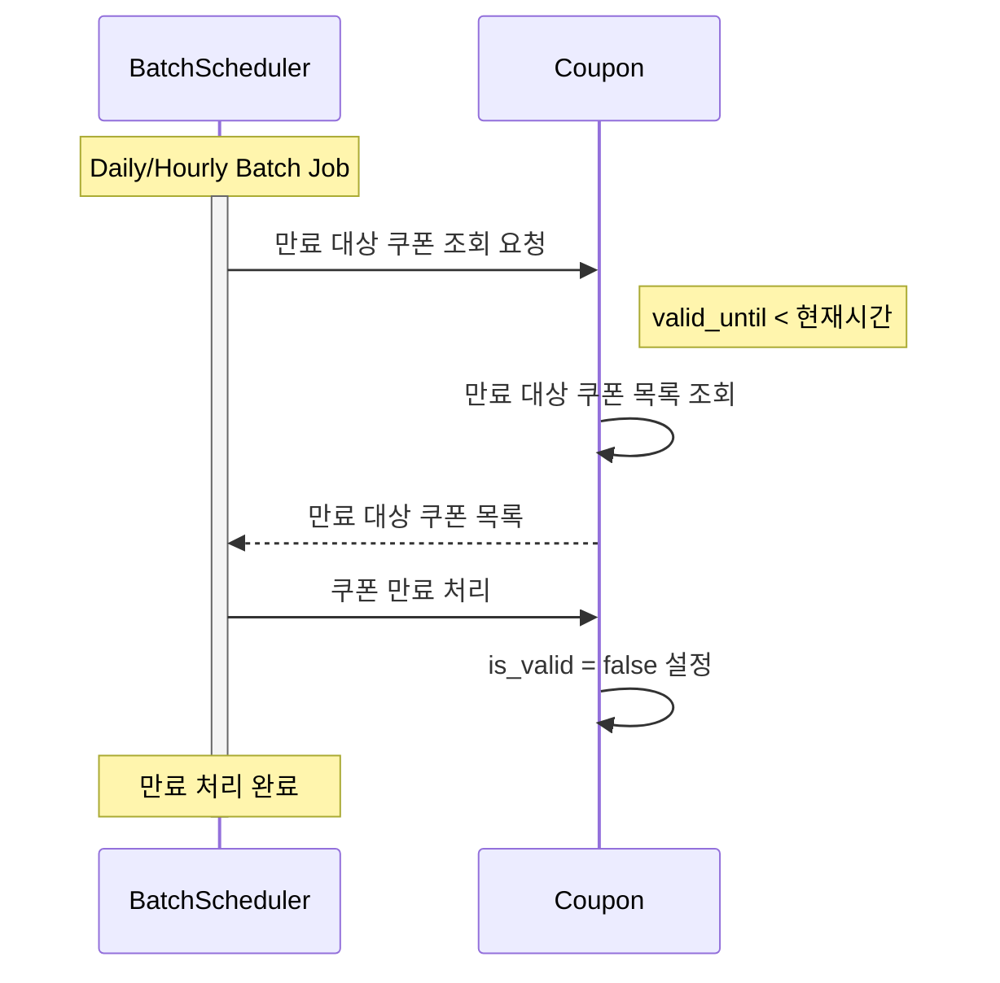

### 목차

- [쿠폰 도메인](#쿠폰-도메인)
- [선착순 쿠폰 발급](#선착순-쿠폰-발급)
- [쿠폰 조회](#쿠폰-조회)
- [쿠폰 사용](#쿠폰-사용)
- [쿠폰 라이프사이클](#쿠폰-라이프사이클)
- [(Optional) \[Batch\] 쿠폰 만료](#optional-batch-쿠폰-만료)

# 쿠폰 도메인

쿠폰(Coupon)은 상품 구매 시 할인 혜택을 제공하는 판촉 수단을 표현하는 도메인 모델입니다. 쿠폰은 템플릿-인스턴스 패턴으로 구현되어 있습니다.

- 쿠폰은 발급, 조회, 사용, 만료, 회수 등의 기본 작업을 지원합니다.
- 쿠폰 템플릿(CouponTemplate)은 쿠폰 정책과 발급 조건을 포함합니다.
  - 쿠폰 템플릿은 최대 발급 수량, 사용자당 발급 제한, 사용 유효조건 등의 제약조건을 가질 수 있습니다.
  - 쿠폰 템플릿은 선착순 발급, 조건부 발급 등 다양한 발급 방식을 지원합니다.
- 사용자 쿠폰(UserCoupon)은 특정 사용자에게 발급된 실제 쿠폰 인스턴스입니다.
  - 사용자 쿠폰은 쿠폰 템플릿에 따라 발급됩니다.
  - 쿠폰의 상태, 쿠폰 템플릿의 정책에 따라 사용 가능합니다
  - 사용자 쿠폰은 금액 할인, 비율 할인 등 다양한 할인 유형을 지원합니다.
  - 만료된 쿠폰은 배치 작업을 통해 자동으로 만료 처리됩니다.

# 선착순 쿠폰 발급

# 쿠폰 조회

# 쿠폰 사용

[주문결제 바로가기](./주문결제.md)

# 쿠폰 라이프사이클

# (Optional) [Batch] 쿠폰 만료

