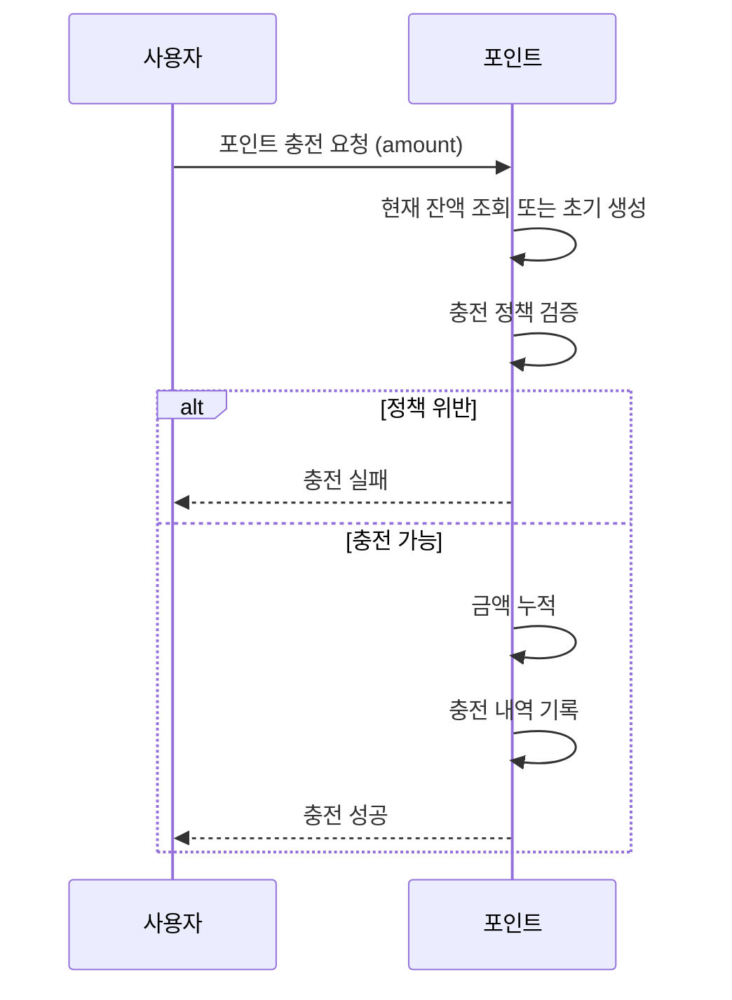

# 포인트 충전 흐름

```mermaid
sequenceDiagram
    participant 사용자
    participant 포인트
    사용자 ->> 포인트: 포인트 충전 요청 (amount)
    포인트 ->> 포인트: 현재 잔액 조회 또는 초기 생성
    포인트 ->> 포인트: 충전 정책 검증
    alt 정책 위반
        포인트 -->> 사용자: 충전 실패
    else 충전 가능
        포인트 ->> 포인트: 금액 누적
        포인트 ->> 포인트: 충전 내역 기록
        포인트 -->> 사용자: 충전 성공
    end
```
